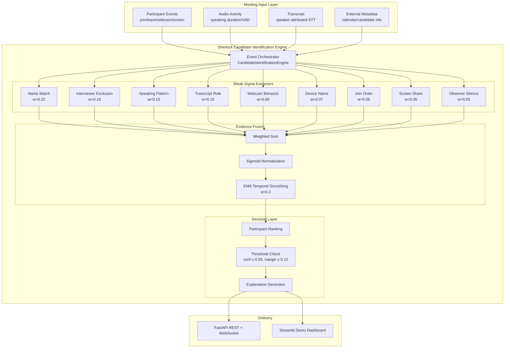

# Architecture

## System Overview



## Data Flow

```
1. Meeting bot captures events → POST /meetings/{id}/events
2. STT pipeline sends transcript → POST /meetings/{id}/transcript
3. Calendar integration sets metadata → POST /meetings/{id}/metadata
4. Engine processes each event:
   a. Update participant state
   b. Run all 9 signal extractors
   c. Fuse signals per participant (weighted sum → sigmoid)
   d. Apply EMA smoothing with prior confidence
   e. Rank participants, check thresholds
   f. Generate explanation
5. Return IdentificationResult with confidence + evidence
6. WebSocket pushes updates to fraud detection pipeline
```

## Signal Design Philosophy

Each signal is intentionally **weak** — no single signal can definitively identify the candidate. This is by design:

| Scenario | Signals that help |
|----------|-------------------|
| "MacBook Pro" display name | Speaking pattern, transcript role, interviewer exclusion |
| Wrong metadata name | Transcript role, speaking pattern (name match neutral) |
| Nickname | Partial name match + transcript confirmation |
| Silent observer | Observer silence, speaking pattern |
| Name change mid-interview | Name history tracking + behavioral signals |

## Confidence Model

```
For each participant:
  1. Each signal produces raw_score ∈ [-1, +1]
  2. weighted_score = raw_score × signal_weight
  3. normalized = Σ(weighted_scores) / Σ(|weights|)
  4. logit = normalized × 4.0
  5. instant_confidence = sigmoid(logit)
  6. confidence = α × instant + (1-α) × prior_confidence

Decision:
  - confidence ≥ 0.55 AND margin ≥ 0.12 → "identified"
  - confidence ≥ 0.40 → "uncertain" (best guess with caveat)
  - else → "uncertain" (no guess)
```

## Real-Time Processing

- Events processed incrementally — O(participants × signals) per event
- EMA smoothing ensures confidence evolves smoothly as interview progresses
- Early interview: likely "uncertain" (insufficient evidence)
- Mid-interview: confidence rises as transcript/speaking data accumulates
- No batch processing required — suitable for streaming WebSocket delivery

## Integration with Sherlock

```
┌──────────────┐     ┌─────────────────────┐     ┌──────────────────┐
│ Meeting Bot  │────►│ Candidate Identifier │────►│ Fraud Detectors  │
│ (Zoom/Meet/  │     │ (this system)        │     │ (deepfake/voice/ │
│  Teams)      │     │                      │     │  behavioral)     │
└──────────────┘     └─────────────────────┘     └──────────────────┘
       │                       │                          │
       │              candidate_id +                analyze ONLY
       │              confidence +                  candidate's A/V
       │              explanation
       ▼                       ▼                          ▼
  Raw A/V streams      IdentificationResult         Fraud alerts
```

## Component Details

### CandidateIdentificationEngine (`engine.py`)
Central orchestrator. Maintains participant state, event history, transcript buffer, and confidence history. Processes events incrementally and returns `IdentificationResult`.

### Signal Extractors (`signals/`)
Pluggable extractors implementing the `SignalExtractor` ABC. Each returns per-participant `SignalContribution` with raw score, weighted score, and explanation. New signals can be added without modifying the fusion layer.

### Fusion (`fusion.py`)
Combines signal contributions via weighted sum → sigmoid → EMA. Handles the math of turning weak evidence into calibrated confidence.

### Explainer (`explainer.py`)
Generates human-readable explanations ranking the top contributing signals and describing why a participant was (or wasn't) selected.

### API (`api/main.py`)
FastAPI server with REST endpoints and WebSocket for real-time streaming. Each meeting gets its own engine instance.

## Scalability Considerations

- **Stateless signals**: each extractor is pure — no shared mutable state
- **Per-meeting engine**: horizontal scaling by meeting ID
- **O(P × S) per event**: P participants, S signals — typically < 50ms
- **No ML inference required**: rule-based signals run without GPU
- **Optional LLM**: transcript role signal degrades gracefully without API key
